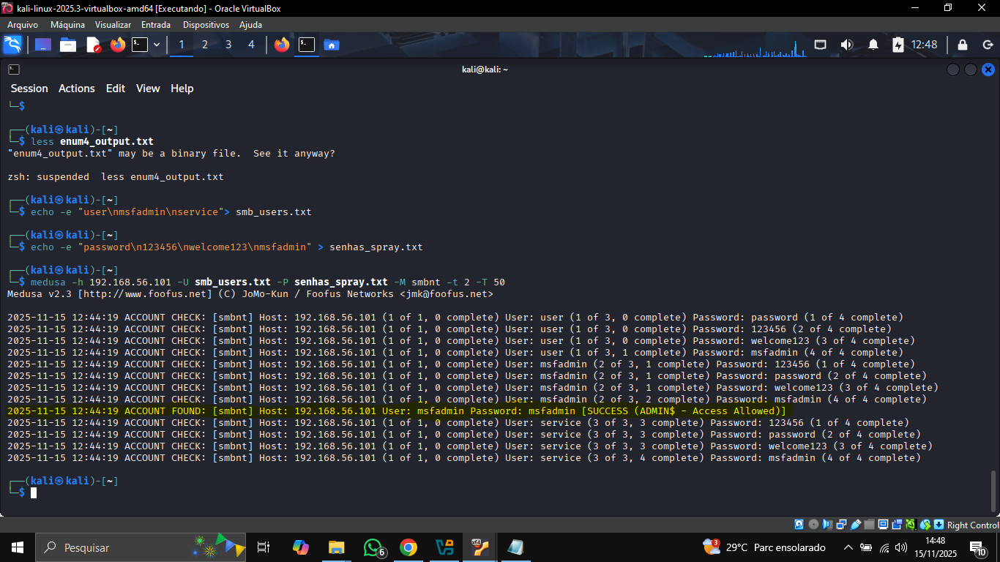

# Medusa - Lab - APA
# 🚀 Medusa Lab: Análise de Protocolos de Autenticação

Este repositório documenta a execução de um projeto prático para o bootcamp de Cibersegurança da [DIO](https://www.dio.me/).
O objetivo é demonstrar a utilização do **Kali Linux** e da ferramenta **Medusa** para realizar simulações de ataques de força bruta em um ambiente de laboratório controlado.

O projeto foca não apenas na execução do ataque, mas principalmente na **análise das vulnerabilidades** e na **documentação das medidas de mitigação** correspondentes.

---

## ⚠️ Aviso Legal (Disclaimer)

**Este projeto foi desenvolvido exclusivamente para fins acadêmicos e educacionais.**

Todas as simulações foram realizadas em um ambiente de laboratório isolado (**VMs em rede Host-Only**),
utilizando máquinas virtuais vulneráveis por design (como Metasploitable 2 e DVWA).

**NÃO TENTE** replicar essas ações em sistemas ou redes que você não possui ou não tem permissão explícita para testar.
Acessar sistemas sem autorização é ilegal.

---

## 🛠️ Ambiente de Laboratório


Para a realização dos testes, foi configurado o seguinte ambiente de laboratório no VirtualBox:

* **Máquina Atacante:**
    * **Sistema:** Kali Linux
* **Máquina-Alvo:**
    * **Sistema:** Metasploitable 2
    * **IP:** `192.168.56.101`
* **Rede:*** 
  * **Tipo:** Rede Interna (Host-Only) para isolar o tráfego do laboratório. 
* **Ferramentas Principais:**
    * `ping` (para teste de conectividade)
    * `nmap` (para enumeração de serviços)
    * `enum4linux` (para enumeração de usuários SMB)
    * `medusa` (para ataque de força bruta)
    * `ftp` e `smbclient` (para validação de acesso)

---

## 🎯 Fases do Ataque e Execução

O projeto seguiu uma metodologia de pentest, dividida em fases de reconhecimento, enumeração, ataque e pós-exploração (validação).

### Fase 1: Reconhecimento e Enumeração de Serviços


Inicialmente, o IP da máquina-alvo (Metasploitable) foi identificado como `192.168.56.101`.


Em seguida, um scan `nmap` foi realizado a partir do Kali Linux para identificar os serviços e portas abertas.


# Teste de conectividade
`ping -c 3 192.168.56.101`

# Scan de portas e serviços
`nmap -sV -p 21,22,80,139,445 192.168.56.101`
O nmap confirmou os seguintes serviços vulneráveis:

Porta 21: FTP (vsftpd 2.3.4)

Porta 80: HTTP (Apache httpd 2.2.8)

Porta 139/445: SMB (Samba smbd 3.x - 4.x)

Fase 2: Cenário de Ataque ao SMB (Samba)
O serviço SMB foi escolhido como um dos vetores de ataque.

Enumeração de Usuários: A ferramenta enum4linux foi usada para extrair uma lista de usuários válidos no sistema-alvo.


Criação de Wordlists: Com base na enumeração, foram criadas listas de usuários e senhas para um ataque focado.


# Criando lista de usuários-alvo

`echo "user\nmsfadmin\nservice" > smb_users.txt`

# Criando lista de senhas para o spray
```bash 
     echo -e "password\n123456\nwelcome123\nmsfadmin" > senhas_spray.txt
```
Execução (Medusa): O Medusa foi utilizado para executar o ataque de força bruta contra o serviço smbnt (SMB).
````bash
     medusa -h 192.168.56.101 -U smb_users.txt -P senhas_spray.txt -M smbnt -t 50
````
Resultado: O Medusa reconheceu com sucesso a credencial **`msfadmin:msfadmin.`**




Validação: O acesso foi validado usando smbclient para listar os compartilhamentos de rede com a credencial descoberta.


Fase 3: Cenário de Ataque ao Formulário Web (DVWA)
O serviço HTTP na porta 80, que hospeda o DVWA (Damn Vulnerable Web Application), foi o segundo vetor.

Execução (Medusa): O Medusa foi configurado para atacar o formulário de login http DVWA.
A ferramenta testou diversas combinações de usuários e senhas.

Resultado: O ataque foi bem-sucedido e revelou múltiplas credenciais válidas,
incluindo admin:password, admin:admin, msfadmin:password, entre outras.


Validação: O acesso foi validado manualmente, realizando o login no painel DVWA com as credenciais descobertas:

**`(admin:password)`**


### Fase 4: Cenário de Ataque ao FTP (vsftpd)

Finalmente, o serviço FTP (porta 21) foi atacado, pois é notório por permitir credenciais fracas ou padrão.

1.  **Execução (Medusa):** O Medusa foi configurado para atacar o serviço `ftp` usando listas de usuários e senhas.

    ```bash
    medusa -h 192.168.56.101 -U users.txt -P pass.txt -M ftp -t 6
    ```

2.  **Resultado:** O ataque foi bem-sucedido e encontrou a credencial padrão **`msfadmin:msfadmin`**.


    


3.  **Validação:** Para confirmar, um login manual foi realizado usando o cliente `ftp` padrão,
   validando o acesso com sucesso.


    
    

🛡️ **Medidas de Mitigação e Defesa**
O objetivo final de um teste de penetração é fortalecer a segurança.
Com base nos ataques simulados, estas são as recomendações de mitigação:

**Contra Força Bruta (Geral):**

**Política de Bloqueio de Contas:**
Implementar uma política que bloqueie a conta (ex: por 15 minutos) após um número baixo de tentativas
falhas (ex: 5 tentativas). Isso torna o ataque de força bruta impraticável.

**Autenticação Multifator (MFA):**
A defesa mais eficaz. Mesmo que a senha seja descoberta,
o atacante não possui o segundo fator (token, SMS, etc.).

**Mitigação para FTP:**

Desabilitar o serviço: Se o FTP não for essencial para o negócio, desabilite-o.

Usar SFTP: Priorizar o uso de SFTP (SSH File Transfer Protocol), que é criptografado e mais seguro.

Senhas Fortes: Proibir o uso de credenciais padrão (como msfadmin/msfadmin).

Mitigação para Web Forms (Login):

Implementar CAPTCHA: Usar reCAPTCHA ou similar para verificar se o login está sendo tentado por um humano.

Limitação de Taxa (Rate Limiting): Limitar o número de tentativas de login que um único endereço IP
pode fazer em um curto período.

Mitigação para SMB:

Não expor o SMB: O serviço SMB (porta 445) NUNCA deve ser exposto diretamente à internet.

Firewall: Restringir o acesso ao SMB apenas para IPs autorizados da rede interna.

Política de Senhas Fortes: Exigir senhas complexas e proibir credenciais padrão.

🎓 **Conclusão sobre o Aprendizados**
Este desafio foi fundamental para solidificar o entendimento de como as vulnerabilidades de autenticação
são exploradas na prática. A facilidade com que o Medusa obteve acesso em um ambiente não protegido
demonstra a importância crítica das medidas de mitigação básicas, como o bloquio de contas e o MFA.
A documentação relacionada ao  processo reforça a mentalidade de um
profissional de segurança (Pentester), que não apenas "ataca", mas analisa, documenta e recomenda soluções.
